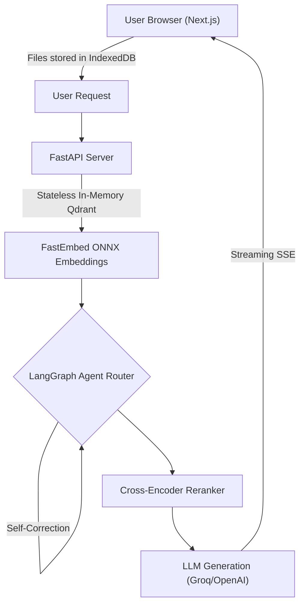

# TheSuperRAG

TheSuperRAG is a serverless, stateless Retrieval-Augmented Generation system. It implements hybrid search, cross-encoder re-ranking, source citations, and client-side document storage.

The backend is built with FastAPI, LangGraph, and Qdrant. The frontend is built with Next.js and uses Server-Sent Events for real-time data streaming.

## System Architecture

The architecture prioritizes data sovereignty and minimal server footprint.

| Component | Technology | Description |
| :--- | :--- | :--- |
| **Storage** | IndexedDB | Documents are stored exclusively in the client browser. The server remains stateless and does not write files to disk. |
| **Vector Engine** | Qdrant | Operates entirely in-memory for vector and sparse indexing. |
| **Embeddings** | FastEmbed (ONNX) | Replaces PyTorch dependencies. Executes dense embedding models and cross-encoders via ONNX runtime to reduce memory overhead. |
| **Routing** | LangGraph | Manages agentic state, validates retrieved context, and performs automated query correction. |
| **Authentication** | Client-Provided | Users supply their own LLM API keys via the frontend interface. The server remains API-agnostic. |

## Feature Specifications

| Feature | Implementation Details |
| :--- | :--- |
| **Hybrid Search** | Combines dense vector search and sparse BM25 retrieval for improved keyword and semantic matching. |
| **Cross-Encoder Reranking** | Re-evaluates retrieved chunks against the original query to filter low-relevance context prior to LLM generation. |
| **Agentic Query Decomposition** | Parses complex questions into parallel sub-queries for multi-step retrieval. |
| **Streaming UI** | Visualizes tool execution, sub-queries, and token generation in real-time via Server-Sent Events. |
| **Web Indexing** | Supports ingestion of web and media links directly into the vector index. Note: Cloud deployments may encounter IP restrictions for external media providers. |
| **Citations** | Maps generated text back to specific source document snippets. |

## Data Flow



## Repository Structure

| File / Directory | Purpose |
| :--- | :--- |
| `server.py` | FastAPI application, endpoint definitions, and SSE streaming handlers. |
| `frontend/` | Next.js application directory. |
| `ingest.py` | Qdrant in-memory initialization and FastEmbed document chunking logic. |
| `reranker.py` | TextCrossEncoder implementation for context scoring. |
| `graph.py` | LangGraph state machine definitions for query processing. |
| `database.py` | SQLAlchemy configuration for session state tracking. |

## Deployment

The system is packaged for containerized deployment using Docker Compose.

### Environment Configuration

Create a `.env` file in the root directory:
```bash
GROQ_API_KEY=your_api_key_here
```

### Docker Execution

Build and run the containers:
```bash
docker-compose up -d --build
```

Services will be accessible at:
* Backend API: `http://localhost:8000/docs`
* Frontend Application: `http://localhost:3000`

## Local Development Setup

1. Clone the repository:
   ```bash
   git clone https://github.com/tanushbhootra576/TheSuperRAG.git
   cd TheSuperRAG
   ```

2. Initialize a virtual environment:
   ```bash
   python -m venv venv
   source venv/bin/activate
   ```

3. Install dependencies:
   ```bash
   pip install -r requirements.txt
   ```

4. Execute the FastAPI Backend:
   ```bash
   uvicorn server:app --reload --host 127.0.0.1 --port 8000
   ```

5. Execute the Frontend:
   ```bash
   cd frontend
   npm install
   npm run dev
   ```

## Citation

To cite this software, refer to the included `CITATION.cff` file.

## License

This project is licensed under the MIT License.
