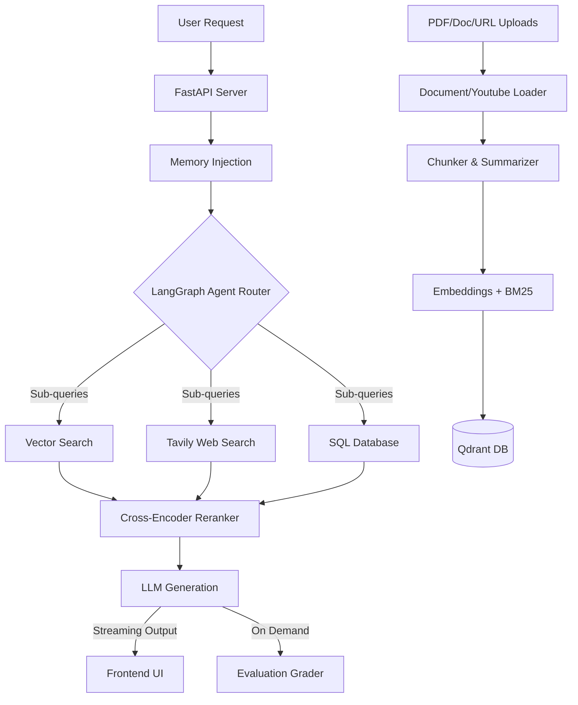

# TheSuperRAG

TheSuperRAG is a Self-Healing Retrieval-Augmented Generation (RAG) backend with hybrid search, re-ranking, citations, confidence scoring, and live document management. 

It provides an advanced document ingestion and chat interface using FastAPI, LangChain, LangGraph, and Qdrant. The project includes real-time notifications for indexing via Server-Sent Events (SSE).

## Features

- **Hybrid Search & Re-ranking:** Combines dense and sparse embeddings to find the most relevant context, scored with confidence.
- **Agentic Query Decomposition:** Automatically breaks down complex multi-hop questions into parallel sub-queries.
- **Multi-Tool Routing:** Dynamically executes Vector Search, Web Search (Tavily), and SQL Database queries.
- **Live Tool Streaming UI:** Visualizes background tool execution and query decomposition in real-time in the frontend.
- **RAG Evaluation Feedback Loop:** Self-grades generated answers for Faithfulness and Relevance.
- **Persistent User Memory:** Editor to store and recall user facts, preferences, and guidelines across sessions.
- **YouTube & Web Indexing:** Allows pasting YouTube URLs or web links to directly transcribe and ingest them into the knowledge base.
- **Self-Healing RAG:** Leverages LangGraph to validate context and heal queries if the required information is missing.
- **Knowledge Graph Support:** Visualizes documents and entity relationships extracted from unstructured data.
- **Live Document Management:** Auto-indexing and immediate processing of drag-and-drop PDF, TXT, and CSV uploads.
- **Streaming Citations:** Streams back text responses while providing interactive references and source snippets.

## Architecture



## Project Structure

- `server.py`: FastAPI server handling document upload, management, and SSE streaming chat endpoints.
- `frontend/`: Next.js frontend application.
- `ingest.py` / `indexer.py`: Handles vector database storage (Qdrant) and automatic folder monitoring.
- `graph.py`: LangGraph setup for self-healing RAG logic.
- `database.py`: SQLAlchemy setup to track chat sessions and graph nodes.
- `DATA/`: Directory containing uploaded PDFs for processing.

## Deployment (Production Ready)

The simplest and most robust way to run TheSuperRAG in a production environment is using Docker Compose.

### Requirements
- Docker
- Docker Compose

### 1. Configure Environment Variables
Create a `.env` file in the root directory and add your API keys:
```bash
GROQ_API_KEY=your_groq_api_key
```

### 2. Run with Docker Compose
To build and start both the backend and frontend in production mode, simply run:
```bash
docker-compose up -d --build
```

- **Backend API**: `http://localhost:8000/docs`
- **Frontend App**: `http://localhost:3000`

The vector database and uploaded files will be persisted in the `DATA/` directory on your host machine.

## Running Locally (Development Mode)

1. Clone the repository:
   ```bash
   git clone https://github.com/tanushbhootra576/TheSuperRAG.git
   cd TheSuperRAG
   ```

2. Create and activate a virtual environment:
   ```bash
   python -m venv venv
   # On Windows
   .\venv\Scripts\activate
   # On Linux/macOS
   source venv/bin/activate
   ```

3. Install the dependencies:
   ```bash
   pip install -r requirements.txt
   ```

4. Start the FastAPI Backend
```bash
uvicorn server:app --reload --host 127.0.0.1 --port 8000
```
API Documentation will be available at `http://127.0.0.1:8000/docs`.

5. Start the Frontend (Next.js)
```bash
cd frontend
npm install
npm run dev
```

## Citation

If you use this software, please cite it using the included `CITATION.cff` file.

## License

This project is licensed under the MIT License.
