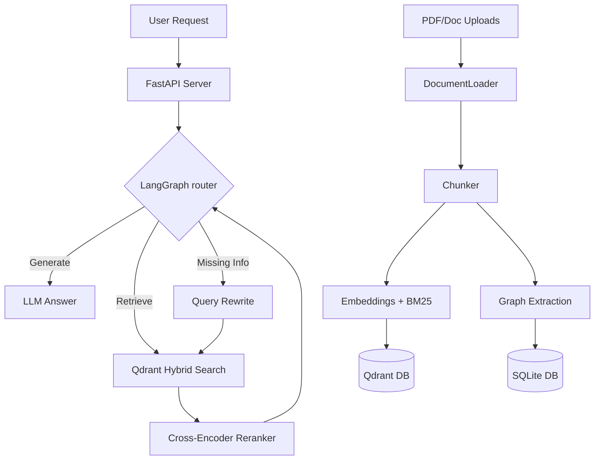

# TheSuperRAG

TheSuperRAG is a Self-Healing Retrieval-Augmented Generation (RAG) backend with hybrid search, re-ranking, citations, confidence scoring, and live document management. 

It provides an advanced document ingestion and chat interface using FastAPI, LangChain, LangGraph, and Qdrant. The project includes real-time notifications for indexing via Server-Sent Events (SSE).

## Features

- **Hybrid Search & Re-ranking:** Combines dense and sparse embeddings to find the most relevant context, scored with confidence.
- **Self-Healing RAG:** Leverages LangGraph to validate context and heal queries if the required information is missing.
- **Knowledge Graph Support:** Visualizes documents and entity relationships extracted from unstructured data.
- **Live Document Management:** Auto-indexing and immediate processing of drag-and-drop PDF uploads.
- **Streaming Citations:** Streams back text responses while providing references to the documents.

## Architecture



## Project Structure

- `server.py`: FastAPI server handling document upload, management, and SSE streaming chat endpoints.
- `frontend/`: Next.js frontend application.
- `ingest.py` / `indexer.py`: Handles vector database storage (Qdrant) and automatic folder monitoring.
- `graph.py`: LangGraph setup for self-healing RAG logic.
- `database.py`: SQLAlchemy setup to track chat sessions and graph nodes.
- `DATA/`: Directory containing uploaded PDFs for processing.

## Installation

1. Clone the repository:
   ```bash
   git clone https://github.com/tanushbhootra576/TheSuperRAG.git
   cd TheSuperRAG
   ```

2. Create and activate a virtual environment:
   ```bash
   python -m venv venv
   # On Windows
   .\venv\Scripts\activate
   # On Linux/macOS
   source venv/bin/activate
   ```

3. Install the dependencies:
   ```bash
   pip install -r requirements.txt
   ```

4. Configure your `.env` file (ensure necessary keys like `GROQ_API_KEY` or `OPENAI_API_KEY` are set if required).

## Running the Application

### 1. Start the FastAPI Backend
```bash
uvicorn server:app --reload --host 127.0.0.1 --port 8000
```
API Documentation will be available at `http://127.0.0.1:8000/docs`.

### 2. Start the Frontend (Next.js)
```bash
cd frontend
npm install
npm run dev
```

## Citation

If you use this software, please cite it using the included `CITATION.cff` file.

## License

This project is licensed under the MIT License.
